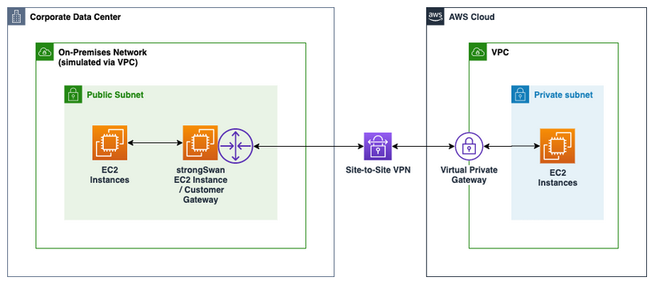
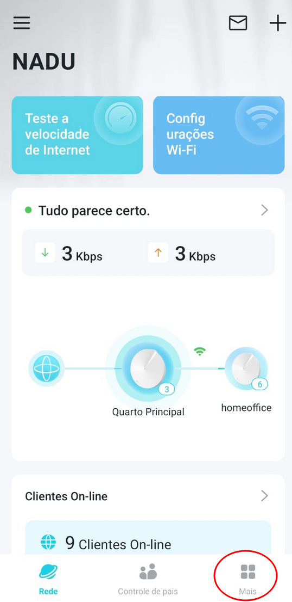

# VPN Port Connectivity Troubleshooting: Claro Network

This guide provides a systematic approach to testing if **IPSEC** ports is successfully traversing your internet service provider. 

In my case I am based in Brazil and I use 'Claro' as service provider. Here we have many others, you can use this example to check your case.

---

## 📑 Index

<details open>
<summary><b>Test VPN port in your network</b></summary>
<ol>
    <li><a href="#step-1">Study case</a></li>
    <li><a href="#step-2">Create an EC2 Instance in your default AWS VPC</a></li>
    <li><a href="#step-3">Open the IPsec port in your router</a></li>
    <ul>
      <li><a href="#step-4">Open the port 500 and forward it to VPN Server </a></li>
    </ul>
    <li><a href="#step-5">Setup UDP Listener on VPN Server</a></li>
    <ul>
      <li><a href="#step-6">Create an UDP Python service</a></li>
      <li><a href="#step-7">Run your service</a></li>
    </ul>
    <li><a href="#step-8">Execute Connectivity Test</a></li>
</ol>
</details>


---

<h2 id="step-1">1. Study case</h2>

The first step is access your router or your service provider router and check if in your WAN port you have a public IP.

    if yes: 
        continue reading this 
    else
        unfortunately, you need a public IP to do that.

From AWS documentation, what we need to do is something like the picture below to sucssefully has a IPsec VPN site-to-site, from your AWS account to your environment using StrongSwan from your side.

AWS Diagram:


My LAB:


--- 
<h2 id="step-2">2. Create an EC2 Instance in your default AWS VPC</h2>

Deploy a small EC2 instance (e.g., t2.micro) within your **Default VPC**. This instance will act as the external "Internet" client to probe your home/office network.

<ul>
    <li><b>Security Group:</b> Ensure Outbound rules allow UDP traffic.</li>
    <li><b>Public IP:</b> Note the Elastic IP or Public IPv4 of this instance.</li>
</ul>


---

<h2 id="step-3">3. Router Configuration (Claro)</h2>

Access your service provider router (my case at `192.168.0.1`) and navigate to the **Port Forwarding / Virtual Server** section.

<table>
  <tr>
    <th>Setting</th>
    <th>Value</th>
  </tr>
  <tr>
    <td><b>External Port</b></td>
    <td>500</td>
  </tr>
  <tr>
    <td><b>Internal Port</b></td>
    <td>500</td>
  </tr>
  <tr>
    <td><b>Protocol</b></td>
    <td>UDP</td>
  </tr>
  <tr>
    <td><b>Target IP</b></td>
    <td>192.168.0.2 (Your Internal Gateway)</td>
  </tr>
</table>

My router TP-Link DECO example:
<table>
  <tr>
    <th>01</th>
    <th>02</th>
    <th>03</th>
    <th>04</th>
    <th>05</th>
    <th>06</th>  
  </tr>
  <tr>
    <td></td>
    <td></td>
    <td></td>
    <td></td>
    <td></td>
    <td></td>
  </tr>
</table>

---

<h2 id="step-5">5. VPN Server Setup</h2>

On the final destination server, we will run a simple Python script to listen for incoming packets to verify the path is open.

### A. Create the UDP Python Service
Create a file named `vpn_test.py`:

<pre style="background-color: #2d2d2d; color: #ccc; border-radius: 5px; padding: 15px;">
<code style="color: #66d9ef;">import</code> socket

UDP_IP = <span style="color: #e6db74;">"0.0.0.0"</span>
UDP_PORT = <span style="color: #ae81ff;">500</span>

sock = socket.socket(socket.AF_INET, socket.SOCK_DGRAM)
sock.bind((UDP_IP, UDP_PORT))

<span style="color: #66d9ef;">print</span>(<span style="color: #e6db74;">f"Listening for VPN traffic on port {UDP_PORT}..."</span>)

<span style="color: #66d9ef;">while True</span>:
    data, addr = sock.recvfrom(<span style="color: #ae81ff;">1024</span>)
    <span style="color: #66d9ef;">print</span>(<span style="color: #e6db74;">f"Received message: {data} from {addr}"</span>)
</pre>

### B. Run the Service
```bash
# You may need sudo as port 500 is a privileged port
sudo python3 vpn_test.py

<h2 id="step-6">6. Test the Connection</h2>

Log in to your AWS EC2 instance and send a test packet toward your Claro Router's Public IP.

<pre style="background-color: #f4f4f4; border-left: 5px solid #007bff; padding: 10px;"> <code>
Use NC (Netcat) to send a UDP packet

echo "VPN_TEST_PACKET" | nc -u -w1 [YOUR_CLARO_PUBLIC_IP] 500 </code> </pre>

    Success Criteria: If the configuration is correct, you will see the message "Received message: b'VPN_TEST_PACKET'" appear in your VPN server's Python console.

<div align="center"> <i>Generated for Network Debugging Documentation • 2026</i> </div>