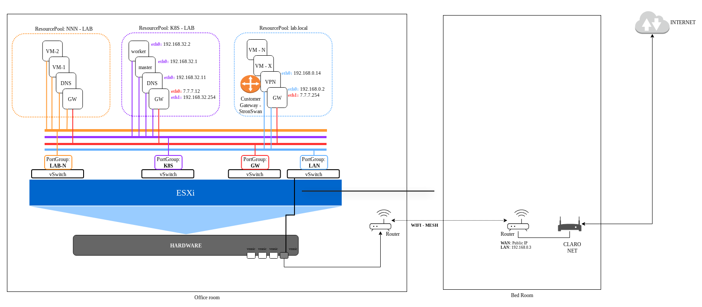
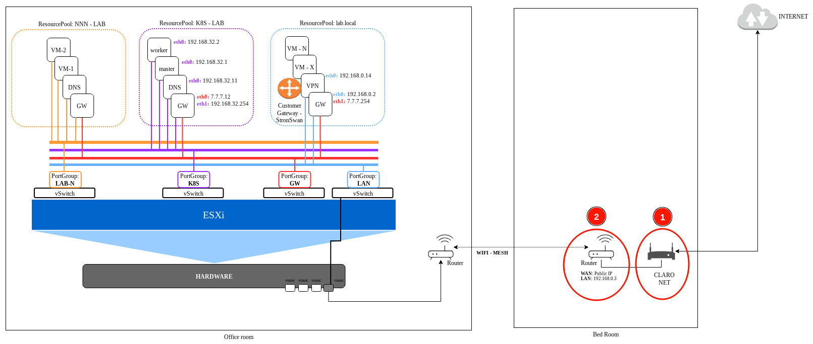
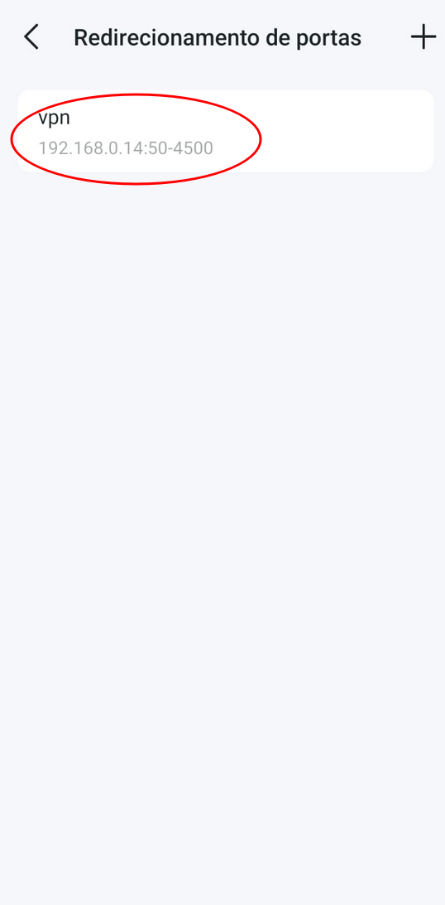
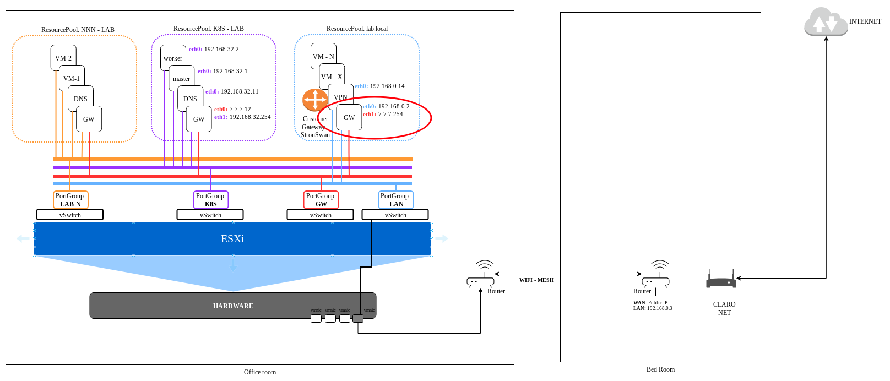

# Setup AWS Site-to-Site VPN Virtual Private Gateway

This is a step-by-step used to deploy a AWS Site-to-Site IPSec VPN using Virtual Private Gateway and Strongswan
 from On-premise side.

---

## 📑 Table of Contents

<details open>
<summary><b>Click to expand/collapse sections</b></summary>

<ul>
    <li>
        <a href="step-1"><b>01. Overview of On-Premise environment</b></a>
        <ul>
            <li><a href="#step-1a">On-premise Diagram</a></li>
			<li><a href="#step-1b">On-Premise and AWS Diagram</a></li>
			<li><a href="#step-1c">Setup your Service Provider Router</a></li>
            <li><a href="#step-1d">Setup Global GW router</a></li>
            <li><a href="#step-1e">Setup Local GW router</a></li>
        </ul>
        <a href="step-2"><b>02. Create a VPN Setup from AWS side</b></a>
        <ul>
            <li><a href="#step-2a">Create VPN Customer Gateway</a></li>
            <li><a href="#step-2b">Create VPN Virtual Private Gateway</a></li>
            <li><a href="#step-2c">Create VPN Connection</a></li>
            <li><a href="#step-2d">Download your VPN configuration</a></li>
            <li><a href="#step-2e">Update "Route table" with your On-Premise network</a></li>
        </ul>
        <a href="step-3"><b>03. Create a VPN setup from On-premise side</b></a>
        <ul>
            <li><a href="#step-3a">Install your Linux (AlmaLinux 9.6)</a></li>
            <li><a href="#step-3b">Install Strongswan (LibreSwan) [1]</a></li>
            <li><a href="#step-3c">Enable "IP Forward"</a></li>
            <li><a href="#step-3d">Create "/etc/ipsec.conf" file</a></li>
            <li><a href="#step-3e">Create "/etc/ipsec.secrets" file/a></li>
            <li><a href="#step-3f">Restart IPsec service</a></li>
            <li><a href="#step-3g">Create HealthCheck script "/etc/ipsec.d/aws-updown.sh"</a></li>
            <li><a href="#step-3h">Restart IPsec service</a></li>
            <li><a href="#step-3i">Check the IPsec VPN services</a></li>
        </ul>
       <a href="step-4"><b>04. Create a VPN setup from On-premise side</b></a>
        <ul>
            <li><a href="#step-4a">Install your Linux (AlmaLinux 9.6)</a></li>
            <li><a href="#step-4b">Install Strongswan (LibreSwan) [1]</a></li>
            <li><a href="#step-4c">Enable "IP Forward"</a></li>
            <ul>
                <li><a href="#step-4c">Enable "IP Forward"</a></li>
                <li><a href="#step-4c">Enable "IP Forward"</a></li>
            </ul>
</ul>
</details>

---
<h2 id="step-1">01. Overview of On-Premise environment</h2>

<h3 id="step-1a">On-premise Diagram</h3>
The picture below shows how is the On-premise environment used in this LAB.


<h3 id="step-1b">On-Premise and AWS Diagram</h3>
The diagram below shows the target Diagram we are going to have after we complete all steps in that article.


<h3 id="step-1c">Setup your Service Provider Router</h3>

First step to do is check if your <em>"Service Provider Router"</em> and your router provide the resources to do that:
	* Public IP
	* Port Forward
	* IPsec Port allowed

To check your environment you can try the article <a href="./01-aws-vpn/01-site-to-site-vpn-with-aws-virtual-private-gateway/00-check-your-lab-environment-before-to-start/README.md">00. Check your LAB environment before to start</a>

Next step is setup your <em>"Service Provider Router"</em>, in my case I use my "service provider as a modem". 

Looking in the picture below you will see a "circle 1". It is my "Service Provider router" and It is working as a modem. It is only sending the internet signal to my person router "circle 2". This one is properly place to do the setup.


The "circle 2" is my person router and the setup is as pictures below.
<table>
  <tr>
    <th>01</th>
    <th>02</th>
    <th>03</th>
    <th>04</th>
    <th>05</th>
    <th>06</th>  
  </tr>
  <tr>
    <td></td>
    <td></td>
    <td></td>
    <td></td>
    <td></td>
    <td></td>
  </tr>
</table>

<h3 id="step-1d">Setup GLobal GW router</h3>
Next step is to setup what I call "Global GW router". There is a dedicated vSwitch to be router of all other LAB's inside the environment. This vSwitch has no physical port.

The "Global GW router" is a Slackware Linux machine using iptables to route packages from other LAB's each other and Internet.

This machine is the machine with the "red circle" on the picture below:


Below you can see the "iptables" configuration

Some details to explain:

This machine has 2 networks:
	* <b>eth0:</b> IP: 192.168.0.2 - Connected to vSwitch "LAN"
	* <b>eth1:</b> IP: 7.7.7.254 - Connected to vSwitch "GW"

* The line "iptables -t nat -A POSTROUTING -s 172.31.0.0/16 -d 192.168.32.0/24 -o eth1 -j MASQUERADE". Is doing a MASQUERADE from the AWS VPC network to LAB network "192.168.32.0/24" . If you want your AWS access any other LAB, one step is to include a similar iptables rule changing the destination network "-d 192.168.32.0/24", for example to "-d 192.168.30.0/24" 

```bash
root@gw:~# cat /etc/rc.d/rc.firewall 
#!/bin/bash 

# enable ip_forwarding
echo 1 > /proc/sys/net/ipv4/ip_forward

# flush iptables rules
iptables -F
iptables -X

iptables -F -t nat
iptables -X -t nat

# enable masquerade
iptables -t nat -A POSTROUTING -o eth0 -j MASQUERADE
iptables -t nat -A POSTROUTING -s 172.31.0.0/16 -d 192.168.32.0/24 -o eth1 -j MASQUERADE

# adding routes

# route to network - EX180
route add -net 192.168.30.0/24 gw 7.7.7.10
 
# route to network - OCP4-EXAMPLE
route add -net 192.168.31.0/24 gw 7.7.7.11
 
# route to network - k8s_lab
route add -net 192.168.32.0/24 gw 7.7.7.12
 
# route to network - vmware_lab
route add -net 192.168.33.0/24 gw 7.7.7.13
 
# route to network - OCP4_VIRTUALIZATION
route add -net 192.168.34.0/24 gw 7.7.7.14
 
# route to network - OCP4_STORAGE
route add -net 192.168.35.0/24 gw 7.7.7.15
 
# route to network - OCP4-AGENT-BASED
route add -net 192.168.36.0/24 gw 7.7.7.16
 
# route to network - OCP4-UPI
route add -net 192.168.37.0/24 gw 7.7.7.17
 
# route to network - GREEN-LAB
route add -net 192.168.38.0/24 gw 7.7.7.18
 
# route to network - POSTGRESQL_LAB
route add -net 192.168.39.0/24 gw 7.7.7.19

# route to AWS
route add -net 172.31.0.0/16 gw 192.168.0.14
```

<h3 id="step-1e">Setup Local GW router</h3>

The GW for each LAB I call as "Local GW router". It is also a Slackware Linux machine using iptables
This machine has 2 networks:
	* <b>eth0:</b> IP: 7.7.7.12 - Connected to vSwitch "GW"
	* <b>eth1:</b> IP: 192.168.32.254 - Connected to vSwitch "K8S"

The picture, there is "red cicle" to show what is the "Local GW router"


The iptables configuration:

```bash
root@gw:~# cat /etc/rc.d/rc.firewall 
#!/bin/bash 

# enable ip_forwarding
echo 1 > /proc/sys/net/ipv4/ip_forward

# flush iptables rules
iptables -F
iptables -X

iptables -F -t nat
iptables -X -t nat

## enable masquerade
iptables -t nat -A POSTROUTING -s 192.168.32.0/24 -o eth0 -j MASQUERADE
iptables -t nat -A POSTROUTING -s 172.31.0.0/16 -d 192.168.32.0/24 -o eth1 -j MASQUERADE
```

<h2 id="step-2">02. Create a VPN Setup from AWS side</h2>
<h3 id="step-2a">a. Create VPN Customer Gateway</h3>

    		AWS console
			→ search "vpc"
				→ click "customer gateway" on VPC session
					click "new customer gateway"
						Name tag: "your customer gateway name"
						IP address: "your on-premise public IP"
						click "create custome gateway"

<h3 id="step-2b">b. Create VPN Virtual Private Gateway</h3>

    		AWS console
			→ search "vpc"
				→ click "virtual private gateway" on VPC session
					Name tag: "your virtual privat gateway name"
					click "create virtual private gateway"
				→ select "your virtual private gateway" 
				→ click "actions"
					→ click "Attach to VPC"
						choose "your VPN"
							→ click "Attach to VPC"

<h3 id="step-2c">c. Create VPN Connection</h3>

    		AWS console
			→ search "vpc"
				→ click on "Site-to-Site VPN connections" on VPC session
					→ click "Create VPN connection"
						Name tag: "add your vpn connection name"
						Target gateway type: select "Virtual private gateway"
						Virtual private gateway: select "your virtual private gatway"
						Customer gateway: select "Existing"
						Customer gateway ID: select "your customer gateway"
						Routing options: select "static"
						Static IP prefixes: "add the static on-primese network - sample: 192.168.0.0/24" (add all you need)
						Pre-shared key storage: select "Standard"
						Click "Create VPN connection"

<h3 id="step-2d">d. Download your VPN configuration</h3>

    		aws console
			→ search "vpc"
					→ select "your vpn connection"
						→ click "in your VPN ID"
							→ click "Download configuration"
								Vendor: "Strongswan"
								Platform: "Ubuntu 16.04"
								Software: "Strongswan 5.5.1+"
								IKE version: "ikev2"
								→ click "Download"

<h3 id="step-2e">e. Update "Route table" with your On-Premise network</h3>
