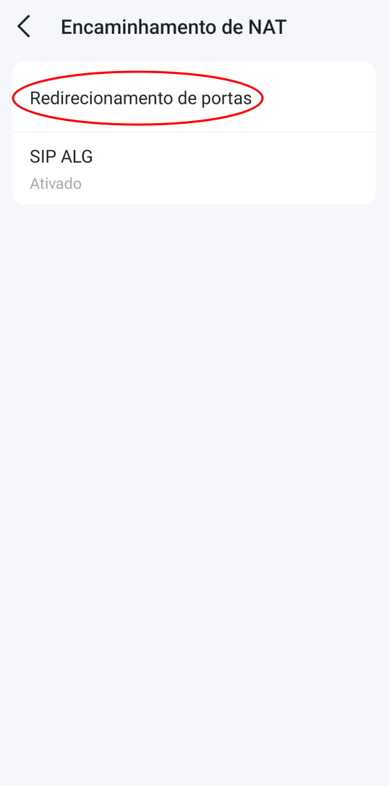
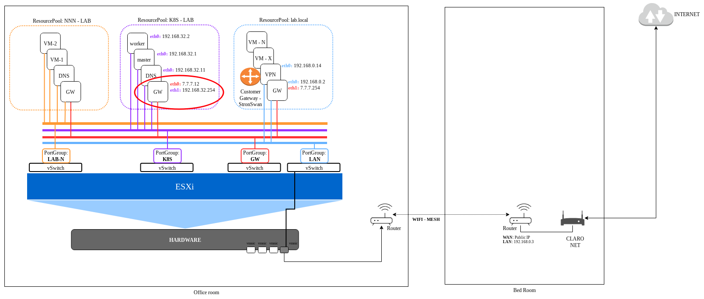

# Setup AWS Site-to-Site VPN Virtual Private Gateway

This is a step-by-step used to deploy a AWS Site-to-Site IPSec VPN using Virtual Private Gateway and Strongswan
 from On-premise side.

---

## 📑 Table of Contents

<details open>
<summary><b>Click to expand/collapse sections</b></summary>

<ul>
    <li>
        <a href="#step-1"><b>01. Overview of On-Premise environment</b></a>
        <ul>
            <li><a href="#step-1a">On-premise Diagram</a></li>
			<li><a href="#step-1b">On-Premise and AWS Diagram</a></li>
			<li><a href="#step-1c">Setup your Service Provider Router</a></li>
            <li><a href="#step-1d">Setup Global GW router</a></li>
            <li><a href="#step-1e">Setup Local GW router</a></li>
        </ul>
        <a href="#step-2"><b>02. Create a VPN Setup from AWS side</b></a>
        <ul>
            <li><a href="#step-2a">Create VPN Customer Gateway</a></li>
            <li><a href="#step-2b">Create VPN Virtual Private Gateway</a></li>
            <li><a href="#step-2c">Create VPN Connection</a></li>
            <li><a href="#step-2d">Download your VPN configuration</a></li>
            <li><a href="#step-2e">Update "Route table" with your On-Premise network</a></li>
        </ul>
        <a href="#step-3"><b>03. Create a VPN setup from On-premise side</b></a>
        <ul>
            <li><a href="#step-3a">Install your Linux (AlmaLinux 9.5)</a></li>
            <li><a href="#step-3b">Install Strongswan (LibreSwan) [1]</a></li>
            <li><a href="#step-3c">Enable "IP Forward"</a></li>
            <li><a href="#step-3d">Create "/etc/ipsec.conf" file</a></li>
            <li><a href="#step-3e">Create "/etc/ipsec.secrets" file/a></li>
            <li><a href="#step-3f">Restart IPsec service</a></li>
            <li><a href="#step-3g">Create HealthCheck script "/etc/ipsec.d/aws-updown.sh"</a></li>
            <li><a href="#step-3h">Restart IPsec service</a></li>
            <li><a href="#step-3i">Check the IPsec VPN services</a></li>
        </ul>
       <a href="#step-4"><b>04. Try the VPN connection</b></a>
        <ul>
            <li><a href="#step-4a">Create a new AWS EC2 instance</a></li>
            <li><a href="#step-4b">Update The Security Group</a></li>
            <li><a href="#step-4c">Make some connection test</a></li>
            <ul>
                <li><a href="#step-4d">From AWS to On-Premise</a></li>
                <li><a href="#step-4e">From On-Premise to AWS</a></li>
            </ul>
		</ul>
</ul>
</details>

---
<h2 id="step-1">01. Overview of On-Premise environment</h2>

<h3 id="step-1a">On-premise Diagram</h3>
The picture below shows how is the On-premise environment used in this LAB.


<h3 id="step-1b">On-Premise and AWS Diagram</h3>
The diagram below shows the target Diagram we are going to have after we complete all steps in that article.


<h3 id="step-1c">Setup your Service Provider Router</h3>

First step to do is check if your <em>"Service Provider Router"</em> and your router provide the resources to do that:
	* Public IP
	* Port Forward
	* IPsec Port allowed

To check your environment you can try the article <a href="./04-aws-vpn/01-site-to-site-vpn-with-aws-virtual-private-gateway/00-check-your-lab-environment-before-to-start/README.md">00. Check your LAB environment before to start</a>

Next step is setup your <em>"Service Provider Router"</em>, in my case I use my "service provider as a modem". 

Looking in the picture below you will see a "circle 1". It is my "Service Provider router" and It is working as a modem. It is only sending the internet signal to my person router "circle 2". This one is properly place to do the setup.


The "circle 2" is my person router and the setup is as pictures below.
<table>
  <tr>
    <th>01</th>
    <th>02</th>
    <th>03</th>
    <th>04</th>
    <th>05</th>
    <th>06</th>  
  </tr>
  <tr>
    <td></td>
    <td></td>
    <td></td>
    <td></td>
    <td></td>
    <td></td>
  </tr>
</table>

<h3 id="step-1d">Setup GLobal GW router</h3>
Next step is to setup what I call "Global GW router". There is a dedicated vSwitch to be router of all other LAB's inside the environment. This vSwitch has no physical port.

The "Global GW router" is a Slackware Linux machine using iptables to route packages from other LAB's each other and Internet.

This machine is the machine with the "red circle" on the picture below:


Below you can see the "iptables" configuration

Some details to explain:

This machine has 2 networks:
	* <b>eth0:</b> IP: 192.168.0.2 - Connected to vSwitch "LAN"
	* <b>eth1:</b> IP: 7.7.7.254 - Connected to vSwitch "GW"

* The line "iptables -t nat -A POSTROUTING -s 172.31.0.0/16 -d 192.168.32.0/24 -o eth1 -j MASQUERADE". Is doing a MASQUERADE from the AWS VPC network to LAB network "192.168.32.0/24" . If you want your AWS access any other LAB, one step is to include a similar iptables rule changing the destination network "-d 192.168.32.0/24", for example to "-d 192.168.30.0/24" 

```bash
root@gw:~# cat /etc/rc.d/rc.firewall 
#!/bin/bash 

# enable ip_forwarding
echo 1 > /proc/sys/net/ipv4/ip_forward

# flush iptables rules
iptables -F
iptables -X

iptables -F -t nat
iptables -X -t nat

# enable masquerade
iptables -t nat -A POSTROUTING -o eth0 -j MASQUERADE
iptables -t nat -A POSTROUTING -s 172.31.0.0/16 -d 192.168.32.0/24 -o eth1 -j MASQUERADE

# adding routes

# route to network - EX180
route add -net 192.168.30.0/24 gw 7.7.7.10
 
# route to network - OCP4-EXAMPLE
route add -net 192.168.31.0/24 gw 7.7.7.11
 
# route to network - k8s_lab
route add -net 192.168.32.0/24 gw 7.7.7.12
 
# route to network - vmware_lab
route add -net 192.168.33.0/24 gw 7.7.7.13
 
# route to network - OCP4_VIRTUALIZATION
route add -net 192.168.34.0/24 gw 7.7.7.14
 
# route to network - OCP4_STORAGE
route add -net 192.168.35.0/24 gw 7.7.7.15
 
# route to network - OCP4-AGENT-BASED
route add -net 192.168.36.0/24 gw 7.7.7.16
 
# route to network - OCP4-UPI
route add -net 192.168.37.0/24 gw 7.7.7.17
 
# route to network - GREEN-LAB
route add -net 192.168.38.0/24 gw 7.7.7.18
 
# route to network - POSTGRESQL_LAB
route add -net 192.168.39.0/24 gw 7.7.7.19

# route to AWS
route add -net 172.31.0.0/16 gw 192.168.0.14
```

* IP's, iptables rules and route table
```bash 
root@gw:~# ip a
1: lo: <LOOPBACK,UP,LOWER_UP> mtu 65536 qdisc noqueue state UNKNOWN group default qlen 1000
    link/loopback 00:00:00:00:00:00 brd 00:00:00:00:00:00
    inet 127.0.0.1/8 scope host lo
       valid_lft forever preferred_lft forever
    inet6 ::1/128 scope host 
       valid_lft forever preferred_lft forever
2: eth0: <BROADCAST,MULTICAST,UP,LOWER_UP> mtu 1500 qdisc pfifo_fast state UP group default qlen 1000
    link/ether 00:50:56:91:54:f2 brd ff:ff:ff:ff:ff:ff
    inet 192.168.0.2/24 brd 192.168.0.255 scope global eth0
       valid_lft forever preferred_lft forever
    inet6 fe80::250:56ff:fe91:54f2/64 scope link 
       valid_lft forever preferred_lft forever
3: eth1: <BROADCAST,MULTICAST,UP,LOWER_UP> mtu 1500 qdisc pfifo_fast state UP group default qlen 1000
    link/ether 00:50:56:91:78:2b brd ff:ff:ff:ff:ff:ff
    inet 7.7.7.254/24 brd 7.7.7.255 scope global eth1
       valid_lft forever preferred_lft forever
    inet6 fe80::250:56ff:fe91:782b/64 scope link 
       valid_lft forever preferred_lft forever

root@gw:~# ip route show
default via 192.168.0.3 dev eth0 
7.7.7.0/24 dev eth1 proto kernel scope link src 7.7.7.254 
127.0.0.0/8 dev lo scope link 
172.31.0.0/16 via 192.168.0.14 dev eth0 
192.168.0.0/24 dev eth0 proto kernel scope link src 192.168.0.2 
192.168.30.0/24 via 7.7.7.10 dev eth1 
192.168.31.0/24 via 7.7.7.11 dev eth1 
192.168.32.0/24 via 7.7.7.12 dev eth1 
192.168.33.0/24 via 7.7.7.13 dev eth1 
192.168.34.0/24 via 7.7.7.14 dev eth1 
192.168.35.0/24 via 7.7.7.15 dev eth1 
192.168.36.0/24 via 7.7.7.16 dev eth1 
192.168.37.0/24 via 7.7.7.17 dev eth1 
192.168.38.0/24 via 7.7.7.18 dev eth1 
192.168.39.0/24 via 7.7.7.19 dev eth1 

root@gw:~# iptables -L -t nat
Chain PREROUTING (policy ACCEPT)
target     prot opt source               destination         

Chain INPUT (policy ACCEPT)
target     prot opt source               destination         

Chain OUTPUT (policy ACCEPT)
target     prot opt source               destination         

Chain POSTROUTING (policy ACCEPT)
target     prot opt source               destination         
MASQUERADE  all  --  anywhere             anywhere            
MASQUERADE  all  --  172.31.0.0/16        192.168.32.0/24     

```

<h3 id="step-1e">Setup Local GW router</h3>

The GW for each LAB I call as "Local GW router". It is also a Slackware Linux machine using iptables
This machine has 2 networks:
	* <b>eth0:</b> IP: 7.7.7.12 - Connected to vSwitch "GW"
	* <b>eth1:</b> IP: 192.168.32.254 - Connected to vSwitch "K8S"

The picture, there is "red cicle" to show what is the "Local GW router"


The iptables configuration:

```bash
root@gw:~# cat /etc/rc.d/rc.firewall 
#!/bin/bash 

# enable ip_forwarding
echo 1 > /proc/sys/net/ipv4/ip_forward

# flush iptables rules
iptables -F
iptables -X

iptables -F -t nat
iptables -X -t nat

## enable masquerade
iptables -t nat -A POSTROUTING -s 192.168.32.0/24 -o eth0 -j MASQUERADE
iptables -t nat -A POSTROUTING -s 172.31.0.0/16 -d 192.168.32.0/24 -o eth1 -j MASQUERADE
```

* IP's, iptables rules and route table

```bash 
root@gw:~# ip a
1: lo: <LOOPBACK,UP,LOWER_UP> mtu 65536 qdisc noqueue state UNKNOWN group default qlen 1000
    link/loopback 00:00:00:00:00:00 brd 00:00:00:00:00:00
    inet 127.0.0.1/8 scope host lo
       valid_lft forever preferred_lft forever
    inet6 ::1/128 scope host 
       valid_lft forever preferred_lft forever
2: eth0: <BROADCAST,MULTICAST,UP,LOWER_UP> mtu 1500 qdisc pfifo_fast state UP group default qlen 1000
    link/ether 00:50:56:91:b2:ee brd ff:ff:ff:ff:ff:ff
    inet 7.7.7.12/24 brd 7.7.7.255 scope global eth0
       valid_lft forever preferred_lft forever
    inet6 fe80::250:56ff:fe91:b2ee/64 scope link 
       valid_lft forever preferred_lft forever
3: eth1: <BROADCAST,MULTICAST,UP,LOWER_UP> mtu 1500 qdisc pfifo_fast state UP group default qlen 1000
    link/ether 00:50:56:91:97:b4 brd ff:ff:ff:ff:ff:ff
    inet 192.168.32.254/24 brd 192.168.32.255 scope global eth1
       valid_lft forever preferred_lft forever
    inet6 fe80::250:56ff:fe91:97b4/64 scope link 
       valid_lft forever preferred_lft forever

root@gw:~# ip route show
default via 7.7.7.254 dev eth0 
7.7.7.0/24 dev eth0 proto kernel scope link src 7.7.7.12 
127.0.0.0/8 dev lo scope link 
192.168.32.0/24 dev eth1 proto kernel scope link src 192.168.32.254 

root@gw:~# iptables -L -t nat
Chain PREROUTING (policy ACCEPT)
target     prot opt source               destination         

Chain INPUT (policy ACCEPT)
target     prot opt source               destination         

Chain OUTPUT (policy ACCEPT)
target     prot opt source               destination         

Chain POSTROUTING (policy ACCEPT)
target     prot opt source               destination         
MASQUERADE  all  --  192.168.32.0/24      anywhere            
MASQUERADE  all  --  172.31.0.0/16        192.168.32.0/24     

```

<h2 id="step-2">02. Create a VPN Setup from AWS side</h2>
<h3 id="step-2a">a. Create VPN Customer Gateway</h3>

    		AWS console
			→ search "vpc"
				→ click "customer gateway" on VPC session
					→ click "Create customer gateway"
						Name tag: "your customer gateway name"
						IP address: "your on-premise public IP"
						click "create custome gateway"

<h3 id="step-2b">b. Create VPN Virtual Private Gateway</h3>

    		AWS console
			→ search "vpc"	
				→ click "virtual private gateway" on VPC session
					→ click "create virtual private gateway"
						Name tag: "your virtual privat gateway name"
						click "create virtual private gateway"
				→ select "your virtual private gateway" --- (wait the state become "Available")
				→ click "actions"
					→ click "Attach to VPC"
						choose "your VPC"
							→ click "Attach to VPC"

<h3 id="step-2c">c. Create VPN Connection</h3>

    		AWS console
			→ search "vpc"
				→ click on "Site-to-Site VPN connections" on VPC session
					→ click "Create VPN connection"
						Name tag: "add your vpn connection name"
						Target gateway type: select "Virtual private gateway"
						Virtual private gateway: select "your virtual private gatway"
						Customer gateway: select "Existing"
						Customer gateway ID: select "your customer gateway"
						Routing options: select "static"
						Static IP prefixes: "add the static on-primese network - sample: 192.168.0.0/24" (add all you need)
						Pre-shared key storage: select "Standard"
						Click "Create VPN connection"

<h3 id="step-2d">d. Download your VPN configuration</h3>

    		aws console
			→ search "vpc"
				→ click "Siste-to-Site VPN connections"
					→ select "your VPN ID"
						→ click "Download configuration"
							Vendor: "Strongswan"
							Platform: "Ubuntu 16.04"
							Software: "Strongswan 5.5.1+"
							IKE version: "ikev1"
							→ click "Download"

<h3 id="step-2e">e. Update "Route table" with your On-Premise network</h3>

			aws console
			→ search "vpc"
				→ click on "Route table"
					→ select your "Route table ID "
						→ click "Actions"
							→ select "Edit routes"
								→ click "Add route"
									Destination: "192.168.32.0/24"
									Target: "Virtual Private Gateway"
									choose: "Your vgw-xxxx-id"
									→ click "Save changes"


<h2 id="step-3">03. Create a VPN setup from On-premise side</h2>

The are some points to align before to start. The files mentioned below will be created using the information from the topic: <a href="#step-2d">Download your VPN configuration</a>

* <b>/etc/ipsec.conf</b>
* <b>/etc/ipsec.secrets</b>
* <b>/etc/ipsec.d/aws-updown.sh</b>

<h3 id="step-3a">Install your Linux (AlmaLinux 9.5)</h3>

```bash
[root@vpn-a ~]# cat /etc/os-release 
NAME="AlmaLinux"
VERSION="9.5 (Teal Serval)"
ID="almalinux"
ID_LIKE="rhel centos fedora"
VERSION_ID="9.5"
PLATFORM_ID="platform:el9"
PRETTY_NAME="AlmaLinux 9.5 (Teal Serval)"
ANSI_COLOR="0;34"
LOGO="fedora-logo-icon"
CPE_NAME="cpe:/o:almalinux:almalinux:9::baseos"
HOME_URL="https://almalinux.org/"
DOCUMENTATION_URL="https://wiki.almalinux.org/"
BUG_REPORT_URL="https://bugs.almalinux.org/"

ALMALINUX_MANTISBT_PROJECT="AlmaLinux-9"
ALMALINUX_MANTISBT_PROJECT_VERSION="9.5"
REDHAT_SUPPORT_PRODUCT="AlmaLinux"
REDHAT_SUPPORT_PRODUCT_VERSION="9.5"
SUPPORT_END=2032-06-01
[root@vpn-a ~]# 
[root@vpn-a ~]# cat /etc/os-release 
NAME="AlmaLinux"
VERSION="9.5 (Teal Serval)"
ID="almalinux"
ID_LIKE="rhel centos fedora"
VERSION_ID="9.5"
PLATFORM_ID="platform:el9"
PRETTY_NAME="AlmaLinux 9.5 (Teal Serval)"
ANSI_COLOR="0;34"
LOGO="fedora-logo-icon"
CPE_NAME="cpe:/o:almalinux:almalinux:9::baseos"
HOME_URL="https://almalinux.org/"
DOCUMENTATION_URL="https://wiki.almalinux.org/"
BUG_REPORT_URL="https://bugs.almalinux.org/"

ALMALINUX_MANTISBT_PROJECT="AlmaLinux-9"
ALMALINUX_MANTISBT_PROJECT_VERSION="9.5"
REDHAT_SUPPORT_PRODUCT="AlmaLinux"
REDHAT_SUPPORT_PRODUCT_VERSION="9.5"
SUPPORT_END=2032-06-01

[root@vpn-a ~]# ip a
1: lo: <LOOPBACK,UP,LOWER_UP> mtu 65536 qdisc noqueue state UNKNOWN group default qlen 1000
    link/loopback 00:00:00:00:00:00 brd 00:00:00:00:00:00
    inet 127.0.0.1/8 scope host lo
       valid_lft forever preferred_lft forever
    inet6 ::1/128 scope host 
       valid_lft forever preferred_lft forever
2: ens192: <BROADCAST,MULTICAST,UP,LOWER_UP> mtu 1500 qdisc mq state UP group default qlen 1000
    link/ether 00:50:56:90:5f:26 brd ff:ff:ff:ff:ff:ff
    altname enp11s0
    inet 192.168.0.14/24 brd 192.168.0.255 scope global noprefixroute ens192
       valid_lft forever preferred_lft forever
    inet6 fe80::250:56ff:fe90:5f26/64 scope link noprefixroute 
       valid_lft forever preferred_lft forever
```

<h3 id="step-3b">Install Strongswan (LibreSwan) [1]</h3>

```bash 
[root@vpn-a ~]# dnf update -y

[root@vpn-a ~]# dnf install epel-release -y

[root@vpn-a ~]# dnf install strongswan libreswan -y

[root@vpn-a ~]# strongswan version
Linux strongSwan U5.9.11/K5.14.0-503.38.1.el9_5.x86_64
University of Applied Sciences Rapperswil, Switzerland
```

<h3 id="step-3c">Enable "IP Forward"</h3>

```bash
[root@vpn-a ~]# echo "net.ipv4.ip_forward = 1" | tee -a /etc/sysctl.conf
[root@vpn-a ~]# sysctl -p
```

<h3 id="step-3d">Create "/etc/ipsec.conf" file</h3>

```bash 
[root@vpn-a ~]# cat /etc/ipsec.conf
# /etc/ipsec.conf - Libreswan 4.0 configuration file
#
# see 'man ipsec.conf' and 'man pluto' for more information
#
# For example configurations and documentation, see https://libreswan.org/wiki/

config setup
	# If logfile= is unset, syslog is used to send log messages too.
	# Note that on busy VPN servers, the amount of logging can trigger
	# syslogd (or journald) to rate limit messages.
	logfile=/var/log/pluto.log
	# 
	# Debugging should only be used to find bugs, not configuration issues!
	# "base" regular debug, "tmi" is excessive (!) and "private" will log
	# sensitive key material (not available in FIPS mode). The "cpu-usage"
	# value logs timing information and should not be used with other
	# debug options as it will defeat getting accurate timing information.
	# Default is "none"
	plutodebug="base"
	# plutodebug="tmi"
	#plutodebug="none"
	#
	# Some machines use a DNS resolver on localhost with broken DNSSEC
	# support. This can be tested using the command:
	# dig +dnssec DNSnameOfRemoteServer
	# If that fails but omitting '+dnssec' works, the system's resolver is
	# broken and you might need to disable DNSSEC.
	# dnssec-enable=no
	#
	# To enable IKE and IPsec over TCP for VPN server. Requires at least
	# Linux 5.7 kernel or a kernel with TCP backport (like RHEL8 4.18.0-291)
	# listen-tcp=yes
	# To enable IKE and IPsec over TCP for VPN client, also specify
	# tcp-remote-port=4500 in the client's conn section.
	uniqueids=no

# if it exists, include system wide crypto-policy defaults
include /etc/crypto-policies/back-ends/libreswan.config

# It is best to add your IPsec connections as separate files
# in /etc/ipsec.d/
include /etc/ipsec.d/*.conf

conn Tunnel1
	auto=start
	#left=%defaultroute
	#leftid=186.x.x.x
	left=192.168.0.14
	leftid=186.x.x.x
	right=15.229.x.x
	type=tunnel
	#leftauth=psk
	#rightauth=psk
	authby=secret
	keyexchange=ike
        ikev2=insist
        #ike=aes256-sha2_256;modp2048
        #esp=aes256-sha2_256
	ike=aes128-sha1-modp2048
	ikelifetime=8h
	esp=aes128-sha1-modp2048
	lifetime=1h
	keyingtries=%forever
	leftsubnet=192.168.0.0/18
	rightsubnet=172.31.0.0/16
	#leftsubnet=0.0.0.0/0
	#rightsubnet=0.0.0.0/0
	dpddelay=10s
        retransmit-timeout=5s
	dpdaction=restart
	## Please note the following line assumes you only have two tunnels in your Strongswan configuration file. This "mark" value must be unique and may need to be changed based on other entries in your configuration file.
	mark=100/0xffffffff
	## Uncomment the following line to utilize the script from the "Automated Tunnel Healhcheck and Failover" section. Ensure that the integer after "-m" matches the "mark" value above, and <VPC CIDR> is replaced with the CIDR of your VPC
	## (e.g. 192.168.1.0/24)
	leftupdown="/etc/ipsec.d/aws-updown.sh -ln Tunnel1 -ll 169.x.x.18/30 -lr 169.x.x.17/30 -m 100 -r 172.31.0.0/16"


conn Tunnel2
	auto=start
	#left=%defaultroute
	#leftid=186.x.x.x
	left=192.168.0.14 #VPN server IP. As It is behind a NAT (My service Provider router) , Need to include this parameter
	leftid=186.x.x.x #my public IP
	right=18.231.x.x
	type=tunnel
	#leftauth=psk
	#rightauth=psk
	authby=secret
	keyexchange=ike
        ikev2=insist
	ike=aes128-sha1-modp2048
	ikelifetime=8h
	esp=aes128-sha1-modp2048
	lifetime=1h
	keyingtries=%forever
	leftsubnet=192.168.0.0/18
	rightsubnet=172.31.0.0/16
	#leftsubnet=0.0.0.0/0
	#rightsubnet=0.0.0.0/0
	dpddelay=10s
        retransmit-timeout=5s
	dpdaction=restart
	## Please note the following line assumes you only have two tunnels in your Strongswan configuration file. This "mark" value must be unique and may need to be changed based on other entries in your configuration file.
	mark=200/0xffffffff
	## Uncomment the following line to utilize the script from the "Automated Tunnel Healhcheck and Failover" section. Ensure that the integer after "-m" matches the "mark" value above, and <VPC CIDR> is replaced with the CIDR of your VPC
	## (e.g. 192.168.1.0/24)
	leftupdown="/etc/ipsec.d/aws-updown.sh -ln Tunnel2 -ll 169.x.x.210/30 -lr 169.x.x.209/30 -m 200 -r 172.31.0.0/16"

```

<h3 id="step-3e">Create "/etc/ipsec.secrets" file</h3>

```bash 
[root@vpn-a ~]# cat /etc/ipsec.secrets 
include /etc/ipsec.d/*.secrets

186.x.x.x 15.229.x.x : PSK "mLVws0OsOqOe_MzCx2WQjaJWTq_FuuC3"
186.x.x.x 18.231.x.x : PSK "SVFLIKsjAUdqlkTqCqA6j4XOFHni8laV"
```

<h3 id="step-3f">Restart IPsec service</h3>

```bash 
[root@vpn-a ~]#  ipsec restart

[root@vpn-a ~]#  systemctl enable strongswan
```

** Note: In my case I stopped FirewallD and disabled selinux

<h3 id="step-3g">Create HealthCheck script "/etc/ipsec.d/aws-updown.sh"</h3>

```bash
[root@vpn-a ~]# cat /etc/ipsec.d/aws-updown.sh 
#!/bin/bash

while [[ $# > 1 ]]; do
	case ${1} in
		-ln|--link-name)
			TUNNEL_NAME="${2}"
			TUNNEL_PHY_INTERFACE="${PLUTO_INTERFACE}"
			shift
			;;
		-ll|--link-local)
			TUNNEL_LOCAL_ADDRESS="${2}"
			TUNNEL_LOCAL_ENDPOINT="${PLUTO_ME}"
			shift
			;;
		-lr|--link-remote)
			TUNNEL_REMOTE_ADDRESS="${2}"
			TUNNEL_REMOTE_ENDPOINT="${PLUTO_PEER}"
			shift
			;;
		-m|--mark)
			TUNNEL_MARK="${2}"
			shift
			;;
		-r|--static-route)
			TUNNEL_STATIC_ROUTE="${2}"
			shift
			;;
		*)
			echo "${0}: Unknown argument \"${1}\"" >&2
			;;
	esac
	shift
done

command_exists() {
	type "$1" >&2 2>&2
}

create_interface() {
	ip link add ${TUNNEL_NAME} type vti local ${TUNNEL_LOCAL_ENDPOINT} remote ${TUNNEL_REMOTE_ENDPOINT} key ${TUNNEL_MARK}
	ip addr add ${TUNNEL_LOCAL_ADDRESS} remote ${TUNNEL_REMOTE_ADDRESS} dev ${TUNNEL_NAME}
	ip link set ${TUNNEL_NAME} up mtu 1419
}

configure_sysctl() {
	sysctl -w net.ipv4.ip_forward=1
	sysctl -w net.ipv4.conf.${TUNNEL_NAME}.rp_filter=2
	sysctl -w net.ipv4.conf.${TUNNEL_NAME}.disable_policy=1
	sysctl -w net.ipv4.conf.${TUNNEL_PHY_INTERFACE}.disable_xfrm=1
	sysctl -w net.ipv4.conf.${TUNNEL_PHY_INTERFACE}.disable_policy=1
}

add_route() {
	IFS=',' read -ra route <<< "${TUNNEL_STATIC_ROUTE}"
    	for i in "${route[@]}"; do
	    ip route add ${i} dev ${TUNNEL_NAME} metric ${TUNNEL_MARK} src 192.168.0.14
	done
	# add your on-premise routes here
	ip route add 192.168.32.0/24 via 192.168.0.2 dev ens192
	#iptables -t mangle -A FORWARD -o ${TUNNEL_NAME} -p tcp --tcp-flags SYN,RST SYN -j TCPMSS --clamp-mss-to-pmtu
	#iptables -t mangle -A INPUT -p esp -s ${TUNNEL_REMOTE_ENDPOINT} -d ${TUNNEL_LOCAL_ENDPOINT} -j MARK --set-xmark ${TUNNEL_MARK}
	#ip route flush table 220
}

cleanup() {
        IFS=',' read -ra route <<< "${TUNNEL_STATIC_ROUTE}"
        for i in "${route[@]}"; do
            ip route del ${i} dev ${TUNNEL_NAME} metric ${TUNNEL_MARK}
        done
	#iptables -t mangle -D FORWARD -o ${TUNNEL_NAME} -p tcp --tcp-flags SYN,RST SYN -j TCPMSS --clamp-mss-to-pmtu
	#iptables -t mangle -D INPUT -p esp -s ${TUNNEL_REMOTE_ENDPOINT} -d ${TUNNEL_LOCAL_ENDPOINT} -j MARK --set-xmark ${TUNNEL_MARK}
	ip route flush cache
}

delete_interface() {
	ip link set ${TUNNEL_NAME} down
	ip link del ${TUNNEL_NAME}
}

# main execution starts here

command_exists ip || echo "ERROR: ip command is required to execute the script, check if you are running as root, mostly to do with path, /sbin/" >&2 2>&2
command_exists iptables || echo "ERROR: iptables command is required to execute the script, check if you are running as root, mostly to do with path, /sbin/" >&2 2>&2
command_exists sysctl || echo "ERROR: sysctl command is required to execute the script, check if you are running as root, mostly to do with path, /sbin/" >&2 2>&2

case "${PLUTO_VERB}" in
	up-client)
		create_interface
		configure_sysctl
		add_route
		;;
	down-client)
		cleanup
		delete_interface
		;;
esac

```

<h3 id="step-3h">Restart IPsec service</h3>

```bash 
[root@vpn-a ~]#  ipsec restart
```

<h3 id="step-3i">Check the IPsec VPN services</h3>

```bash
[root@vpn-a ~]# ipsec status
000 using kernel interface: xfrm
000  
000 interface lo UDP [::1]:4500
000 interface lo UDP [::1]:500
000 interface lo UDP 127.0.0.1:4500
000 interface lo UDP 127.0.0.1:500
000 interface ens192 UDP 192.168.0.14:4500
000 interface ens192 UDP 192.168.0.14:500
000  
000 fips mode=disabled;
000 SElinux=disabled
000 seccomp=disabled
000  
000 config setup options:
...
000  
000 Total IPsec connections: loaded 2, active 2
000  
000 State Information: DDoS cookies not required, Accepting new IKE connections
000 IKE SAs: total(2), half-open(0), open(0), authenticated(2), anonymous(0)
000 IPsec SAs: total(2), authenticated(2), anonymous(0)
000  
...
000  
000 Bare Shunt list:
000  

```

```bash 
[root@vpn-a ~]# ip a
1: lo: <LOOPBACK,UP,LOWER_UP> mtu 65536 qdisc noqueue state UNKNOWN group default qlen 1000
    link/loopback 00:00:00:00:00:00 brd 00:00:00:00:00:00
    inet 127.0.0.1/8 scope host lo
       valid_lft forever preferred_lft forever
    inet6 ::1/128 scope host 
       valid_lft forever preferred_lft forever
2: ens192: <BROADCAST,MULTICAST,UP,LOWER_UP> mtu 1500 qdisc mq state UP group default qlen 1000
    link/ether 00:50:56:90:5f:26 brd ff:ff:ff:ff:ff:ff
    altname enp11s0
    inet 192.168.0.14/24 brd 192.168.0.255 scope global noprefixroute ens192
       valid_lft forever preferred_lft forever
    inet6 fe80::250:56ff:fe90:5f26/64 scope link noprefixroute 
       valid_lft forever preferred_lft forever
3: ip_vti0@NONE: <NOARP> mtu 1480 qdisc noop state DOWN group default qlen 1000
    link/ipip 0.0.0.0 brd 0.0.0.0
4: Tunnel2@NONE: <POINTOPOINT,NOARP,UP,LOWER_UP> mtu 1419 qdisc noqueue state UNKNOWN group default qlen 1000
    link/ipip 192.168.0.14 peer 18.231.x.x
    inet 169.254.x.x peer 169.254.x.x/30 scope global Tunnel2
       valid_lft forever preferred_lft forever
    inet6 fe80::5efe:c0a8:e/64 scope link 
       valid_lft forever preferred_lft forever
5: Tunnel1@NONE: <POINTOPOINT,NOARP,UP,LOWER_UP> mtu 1419 qdisc noqueue state UNKNOWN group default qlen 1000
    link/ipip 192.168.0.14 peer 15.229.x.x
    inet 169.254.x.x peer 169.254.x.x/30 scope global Tunnel1
       valid_lft forever preferred_lft forever
    inet6 fe80::5efe:c0a8:e/64 scope link 
       valid_lft forever preferred_lft forever

```

```bash 
[root@vpn-a ~]# ip route show
default via 192.168.0.3 dev ens192 proto static metric 100 
169.254.16.208/30 dev Tunnel2 proto kernel scope link src 169.254.16.210 
169.254.71.16/30 dev Tunnel1 proto kernel scope link src 169.254.71.18 
172.31.0.0/16 dev Tunnel1 scope link src 192.168.0.14 metric 100 
172.31.0.0/16 dev Tunnel2 scope link src 192.168.0.14 metric 200 
192.168.0.0/24 dev ens192 proto kernel scope link src 192.168.0.14 metric 100 
192.168.32.0/24 via 192.168.0.2 dev ens192 
```

<b>From AWS side:</b>

			aws console
			→ search "vpc"
				→ click "Site-to-Site VPN connections"
					→ click on "VPN ID"
						→ check "Tunnel details" tab
				


<h2 id="step-4">04. Try the VPN connection</h2>
<h3 id="step-4a">Create a new AWS EC2 instance</h3>


<h3 id="step-4a">Update The Security Group</h3>

			aws console
			→ search "EC2"
				→ click "Instances"
					→ click in your "your Instance ID"
						→ click in your "Security groups" on Security tab
							→ click "Edit inbound rules" in "Inbound rules"
								→ click "Add rule"
									Type: "All ICMP - IPv4"
									Source: Custom
											0.0.0.0/0
									→ click "Save rules"


<h3 id="step-4b">Make some connection test</h3>

<h4 id="step-4c">From AWS to On-Premise</h4>

* Tests from EC2 Instance to VPN server

```bash 
ubuntu@ip-172-31-12-234:~$ ping -c3 192.168.0.14
PING 192.168.0.14 (192.168.0.14) 56(84) bytes of data.
64 bytes from 192.168.0.14: icmp_seq=1 ttl=64 time=16.0 ms
64 bytes from 192.168.0.14: icmp_seq=2 ttl=64 time=16.7 ms
64 bytes from 192.168.0.14: icmp_seq=3 ttl=64 time=14.7 ms

--- 192.168.0.14 ping statistics ---
3 packets transmitted, 3 received, 0% packet loss, time 2003ms
rtt min/avg/max/mdev = 14.708/15.801/16.725/0.832 ms
```

* Tests from EC2 Instance to "Global GW router"

```bash 
ubuntu@ip-172-31-12-234:~$ ping -c3 192.168.0.2
PING 192.168.0.2 (192.168.0.2) 56(84) bytes of data.
64 bytes from 192.168.0.2: icmp_seq=1 ttl=63 time=17.9 ms
64 bytes from 192.168.0.2: icmp_seq=2 ttl=63 time=15.9 ms
64 bytes from 192.168.0.2: icmp_seq=3 ttl=63 time=15.8 ms

--- 192.168.0.2 ping statistics ---
3 packets transmitted, 3 received, 0% packet loss, time 2004ms
rtt min/avg/max/mdev = 15.844/16.562/17.938/0.973 ms

```

* Tests from EC2 Instance to a virtual machine on "192.168.32.0/24" network

```bash 
ubuntu@ip-172-31-12-234:~$ ping -c3 192.168.32.2
PING 192.168.32.2 (192.168.32.2) 56(84) bytes of data.
64 bytes from 192.168.32.2: icmp_seq=1 ttl=61 time=19.7 ms
64 bytes from 192.168.32.2: icmp_seq=2 ttl=61 time=15.7 ms
64 bytes from 192.168.32.2: icmp_seq=3 ttl=61 time=15.7 ms

--- 192.168.32.2 ping statistics ---
3 packets transmitted, 3 received, 0% packet loss, time 2004ms
rtt min/avg/max/mdev = 15.690/17.044/19.697/1.876 ms
```

```bash 
ubuntu@ip-172-31-12-234:~$ traceroute -n 192.168.32.2
traceroute to 192.168.32.2 (192.168.32.2), 30 hops max, 60 byte packets
 1  192.168.0.14  15.498 ms  15.460 ms  21.405 ms
 2  192.168.0.2  21.415 ms  21.393 ms  21.373 ms
 3  * * *
 4  192.168.32.2  21.470 ms  21.410 ms  21.467 ms
```

```bash 
ubuntu@ip-172-31-12-234:~$ curl -v telnet://192.168.32.2:22
*   Trying 192.168.32.2:22...
* Connected to 192.168.32.2 (192.168.32.2) port 22
SSH-2.0-OpenSSH_X.X

```

<h4 id="step-4d">From On-Premise to AWS</h4>

* Tests from VPN server to AWS EC2 Instance

```bash
[root@vpn-a ~]# ping -c3 172.31.12.234
PING 172.31.12.234 (172.31.12.234) 56(84) bytes of data.
64 bytes from 172.31.12.234: icmp_seq=1 ttl=64 time=26.4 ms
64 bytes from 172.31.12.234: icmp_seq=2 ttl=64 time=25.6 ms
64 bytes from 172.31.12.234: icmp_seq=3 ttl=64 time=28.1 ms

--- 172.31.12.234 ping statistics ---
3 packets transmitted, 3 received, 0% packet loss, time 2003ms
rtt min/avg/max/mdev = 25.582/26.687/28.119/1.061 ms

```

* Tests from "Global GW router" to AWS EC2 Instance

```bash 
root@gw:~# ping -c3 172.31.12.234
PING 172.31.12.234 (172.31.12.234) 56(84) bytes of data.
64 bytes from 172.31.12.234: icmp_seq=1 ttl=63 time=16.3 ms
64 bytes from 172.31.12.234: icmp_seq=2 ttl=63 time=15.1 ms
64 bytes from 172.31.12.234: icmp_seq=3 ttl=63 time=15.7 ms

--- 172.31.12.234 ping statistics ---
3 packets transmitted, 3 received, 0% packet loss, time 2003ms
rtt min/avg/max/mdev = 15.127/15.710/16.339/0.495 ms

```

* Tests from a virtual machine on "192.168.32.0/24" network to AWS EC2 Instance

```bash 
[root@worker01 ~]# ip a
1: lo: <LOOPBACK,UP,LOWER_UP> mtu 65536 qdisc noqueue state UNKNOWN group default qlen 1000
    link/loopback 00:00:00:00:00:00 brd 00:00:00:00:00:00
    inet 127.0.0.1/8 scope host lo
       valid_lft forever preferred_lft forever
    inet6 ::1/128 scope host 
       valid_lft forever preferred_lft forever
2: ens192: <BROADCAST,MULTICAST,UP,LOWER_UP> mtu 1500 qdisc mq state UP group default qlen 1000
    link/ether 00:50:56:91:78:36 brd ff:ff:ff:ff:ff:ff
    inet 192.168.32.2/24 brd 192.168.32.255 scope global noprefixroute ens192
       valid_lft forever preferred_lft forever
    inet6 fe80::1571:7b67:33c7:ddd0/64 scope link noprefixroute 
       valid_lft forever preferred_lft forever

[root@worker01 ~]# ip route show
default via 192.168.32.254 dev ens192 proto static metric 100 
192.168.32.0/24 dev ens192 proto kernel scope link src 192.168.32.2 metric 100 

[root@worker01 ~]# ping -c3 172.31.12.234
PING 172.31.12.234 (172.31.12.234) 56(84) bytes of data.
64 bytes from 172.31.12.234: icmp_seq=1 ttl=61 time=16.0 ms
64 bytes from 172.31.12.234: icmp_seq=2 ttl=61 time=17.7 ms
64 bytes from 172.31.12.234: icmp_seq=3 ttl=61 time=17.7 ms

--- 172.31.12.234 ping statistics ---
3 packets transmitted, 3 received, 0% packet loss, time 2002ms
rtt min/avg/max/mdev = 16.016/17.181/17.768/0.838 ms

[root@worker01 ~]# traceroute -n 172.31.12.234
traceroute to 172.31.12.234 (172.31.12.234), 30 hops max, 60 byte packets
 1  192.168.32.254  0.135 ms  0.096 ms  0.104 ms
 2  7.7.7.254  0.276 ms  0.260 ms  0.233 ms
 3  192.168.0.14  0.269 ms  0.321 ms  0.320 ms
 4  * * *
 5  * * *
 6  * * *
 7  * * *
 8  * * *
 9  * * *
10  * * *
11  * * *
12  * * *
13  * * *
14  * * *
15  * * *
16  * * *
17  * * *
18  * * *
19  * * *
20  * * *
21  * * *
22  * * *
23  * * *
24  * * *
25  * * *
26  * * *
27  * * *
28  * * *
29  * * *
30  * * *

[root@worker01 ~]# curl -v telnet://172.31.12.234:22
* About to connect() to 172.31.12.234 port 22 (#0)
*   Trying 172.31.12.234...
* Connected to 172.31.12.234 (172.31.12.234) port 22 (#0)
SSH-2.0-OpenSSH_9.6p1 Ubuntu-3ubuntu13.14

```

<h3 id="references">References</h3>
<ul>
    <li><a href="https://www.youtube.com/watch?v=VRTC0tfNc6I"><b>YouTube:</b> 02. AWS Site-to-Site VPN Setup Using StrongSwan Gateway</a></li>
    <li><a href="https://aws.amazon.com/documentation-overview/vpn/"><b>AWS:</b> AWS Virtual Private Network Documentation</a></li>
    <li><a href="https://github.com/aws-samples/vpn-gateway-strongswan"><b>GitHub:</b> VPN Gateway Stack Using strongSwan</a></li>
    <li><a href="https://aws-deployments.hashnode.dev/aws-site-to-site-vpn-setup-using-strongswan-gateway#heading-3-configure-strongswan-on-linux-vm"><b>Tutorial:</b> AWS Site-to-Site VPN Setup Using StrongSwan Gateway</a></li>
    
</ul>